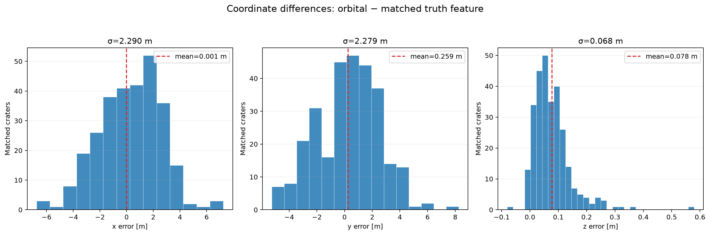

# Lunar Global Localization

Experimental global localization for a lunar rover using terrain features
extracted from digital elevation models (DEMs) and local LiDAR scans. The main
Apollo 17 pipeline detects crater minima at multiple map resolutions, builds
local elevation maps, estimates feature uncertainty, and evaluates rover poses
with DARCES-style geometric matching.

The actively developed, resolution-aware implementation is in
[`LargeScale_Implement/`](LargeScale_Implement/). The modules and scripts at the
repository root are an earlier prototype and remain useful for reference and
small synthetic experiments.


## What is where

```text
.
├── LargeScale_Implement/       Main Apollo 17 pipeline
│   ├── config/                 Shared experiment and resolution profiles
│   ├── DEM/                    DEMs, feature catalogues, QA, and validation
│   ├── Scripts/                Numbered pipeline entry points (00–09)
│   ├── features/               Crater/peak detector
│   ├── matching/               DARCES and RANSAC matching
│   ├── refinement/             MOGA pose refinement
│   ├── local_maps/             Leveled scans, grids, and local features
│   ├── sim/                    Captured point clouds, odometry, and transforms
│   ├── plots/                  Diagnostic figures grouped by resolution
│   ├── results/                Machine-readable localization results
│   ├── tests/                  Configuration, detector, and matcher tests
│   ├── pipeline_config.py      Validated configuration and path projection
│   └── DATA_LAYOUT.md          Resolution-directory conventions
├── config/                     Configuration for the earlier prototype
├── features/, maps/            Earlier feature and map modules
├── matching/, refinement/      Earlier matching and refinement modules
├── scripts/                    Earlier exploratory scripts
└── sim/                        Earlier traversal recorder
```

Within the main implementation, generated and captured data are grouped by
resolution:

```text
LargeScale_Implement/
├── DEM/<resolution>_px/
├── local_maps/<resolution>_px/
├── plots/<resolution>_px/
├── results/<resolution>_px/
└── sim/<resolution>_px/
```

Resolution labels use `p` as the decimal separator. The currently configured
profiles are `0p25m`, `1p5m`, and `5m`.

## Data currently included

| Profile | Primary DEM | Shape | Current role |
| --- | --- | ---: | --- |
| `0p25m` | `DEM/0p25m_px/apollo17_refined_0p25m_2000m.npy` | 8000 × 8000 | Native high-resolution OmniLRS DEM |
| `1p5m` | `DEM/1p5m_px/truth_dem_1p5m.npy` | 1334 × 1334 | Truth/reference raster |
| `5m` | `DEM/5m_px/orbital_dem_5m.npy` | 400 × 400 | Coarse orbital localization prior |

The 5 m workspace also contains a complete example set of 28 captured sites,
leveled/gridded local maps, local crater catalogues, validation products, and
DARCES result files. Other resolutions can use the same pipeline once their
corresponding inputs are placed in the projected subdirectories.

The 0.25 m DEM is stored with **Git LFS** because it is approximately 244 MiB.
After cloning, run `git lfs pull` before using that profile.

## Installation

Python 3.10 or newer is recommended. There is not yet a pinned requirements
file, so install the core scientific dependencies directly:

```bash
python3 -m venv .venv
source .venv/bin/activate
python3 -m pip install numpy scipy matplotlib pyyaml opencv-python pytest
git lfs install
git lfs pull
```

OpenCV is used to accelerate large circular morphology operations on the
8000 × 8000 DEM. The detector retains a SciPy fallback for environments where
OpenCV is unavailable. The ROS capture utilities under
`LargeScale_Implement/sim/` additionally require a ROS 2 environment with
`rclpy`, message packages, and `sensor_msgs_py`.

## Configuration and resolution selection

[`LargeScale_Implement/config/apollo17_5m.yaml`](LargeScale_Implement/config/apollo17_5m.yaml)
is the shared configuration authority. Despite its historical filename, it
contains the detector inputs and parameters for all configured resolutions
under `feature_detection.resolutions`.

Every numbered script accepts `--resolution`:

```bash
python3 LargeScale_Implement/Scripts/00_inspect_DEM.py --resolution 0p25m
python3 LargeScale_Implement/Scripts/03_feature_detector.py --resolution 1p5m
python3 LargeScale_Implement/Scripts/09_darces_all_sites.py --resolution 5m
python3 LargeScale_Implement/Scripts/11_ransac_all_sites.py --resolution 5m
python3 LargeScale_Implement/Scripts/12_moga_all_sites.py --resolution 5m
```

All scripts default to `5m`. The feature detector also accepts
`--resolution all`. Use `--help` on any script for its remaining controls.
Script 05 reserves `--resolution` for workspace selection and uses
`--grid-resolution` for an optional cell-size override.

Selecting a profile changes the whole workspace, not only the DEM. For example,
`--resolution 0p25m` selects:

```text
DEM/0p25m_px/
local_maps/0p25m_px/
plots/0p25m_px/
results/0p25m_px/
sim/0p25m_px/
```

## Main pipeline

Run commands from the repository root. Replace `5m` with another configured
profile when its required input data are available.

### 1. Inspect or build the DEM

```bash
python3 LargeScale_Implement/Scripts/00_inspect_DEM.py --resolution 5m
python3 LargeScale_Implement/Scripts/01_build_orbital_dem.py --resolution 5m
python3 LargeScale_Implement/Scripts/02_validate_dem_allignment.py --resolution 5m
```

Script 01 performs area-weighted downsampling from the 1.5 m truth reference.
It intentionally refuses to create a finer 0.25 m DEM from that coarser source.
The native 0.25 m DEM should be generated or acquired independently.

### 2. Detect and validate global features

```bash
python3 LargeScale_Implement/Scripts/03_feature_detector.py --resolution 5m
python3 LargeScale_Implement/Scripts/04_global_feature_uncertainty.py --resolution 5m
```

Detector radius, physical distance, flatness tolerance, DEM path, output path,
and preview path are resolution-specific configuration values. Feature
catalogues are compressed NumPy archives containing raster indices, map-frame
XYZ coordinates, feature type, resolution, and detector metadata.



### 3. Process local LiDAR scans

Place site data under the selected `sim/<resolution>_px/` workspace:

```text
pointcloud_scans/scan_site_XX.npy
odom_scans/odom_site_XX.npy
transform_scan/transform_site_XX.npz
```

Then run:

```bash
python3 LargeScale_Implement/Scripts/05_local_scan_processing.py --resolution 5m
python3 LargeScale_Implement/Scripts/06_validate_capture.py --resolution 5m
python3 LargeScale_Implement/Scripts/07_local_feature_detection.py --resolution 5m
```

Script 05 transforms scans into gravity-leveled rover-local coordinates and
creates north-up elevation grids. Script 07 detects local crater features and
stores feature covariance estimates used by matching.


### 4. Run localization

```bash
# Focused Site 08 run
python3 LargeScale_Implement/Scripts/08_darces_run.py \
  --resolution 5m \
  --trials 100000

# All captured sites
python3 LargeScale_Implement/Scripts/09_darces_all_sites.py \
  --resolution 5m \
  --trials 100000

# Covariance-aware exhaustive consensus refinement
python3 LargeScale_Implement/Scripts/11_ransac_all_sites.py \
  --resolution 5m

# Joint multi-frame landmark/pose refinement
python3 LargeScale_Implement/Scripts/12_moga_all_sites.py \
  --resolution 5m
```

Results are written to `LargeScale_Implement/results/<resolution>_px/` as JSON
and CSV files. RANSAC diagnostic plots are written below
`LargeScale_Implement/plots/<resolution>_px/ransac/`. DARCES uses local/global
feature geometry and a heading prior; absolute odometry position is withheld
from matching and used for evaluation. RANSAC preserves the DARCES estimate
when a consensus cannot be tested or does not produce a supported improvement.
MOGA jointly optimizes feature-derived 2-D poses, headings, and shared global
landmark positions with feature, landmark-prior, and heading-sensor residuals.
Sites without a DARCES/RANSAC pose remain unavailable, and false global aliases
remain visible. Odometry position is used only for post-localization error
evaluation and the truth overlay; it is never used to initialize or constrain
a pose. Its output and
traversal plot are written to `results/<resolution>_px/moga_all_sites.*` and
`plots/<resolution>_px/moga/`.

## Coordinate conventions

The main pipeline uses a north-up Cartesian map frame:

- `x`: east
- `y`: north
- `z`: up
- raster columns increase with `x`
- raster rows increase as `y` decreases
- row 0 is the northern edge
- positive yaw is counter-clockwise

The map origin is at the center of the Apollo 17 crop. Raster-to-map conversion
uses cell-center coordinates defined in the shared configuration. Preserve
these conventions when adding DEMs or local grids; silent row flips are a
common source of incorrect localization results.

## Tests

Run the focused configuration and geometry tests with:

```bash
python3 -m pytest LargeScale_Implement/tests/test_phase1.py -q
```

Run the complete main-implementation suite with:

```bash
python3 -m pytest LargeScale_Implement/tests -q
```

## Important notes

- Do not commit the 0.25 m DEM as an ordinary Git blob. Its path is already
  tracked by Git LFS in `.gitattributes`.
- Generated products should stay in their resolution workspace to avoid mixing
  incompatible cell sizes, feature radii, and coordinate vectors.
- A selected resolution does not manufacture missing captures or local maps;
  scripts report missing inputs when that workspace has not been populated.
- `.npz` feature and grid files carry resolution and coordinate metadata. Prefer
  reading those fields rather than reconstructing coordinates from filenames.
- See [`LargeScale_Implement/DATA_LAYOUT.md`](LargeScale_Implement/DATA_LAYOUT.md)
  for the concise data-layout contract.
